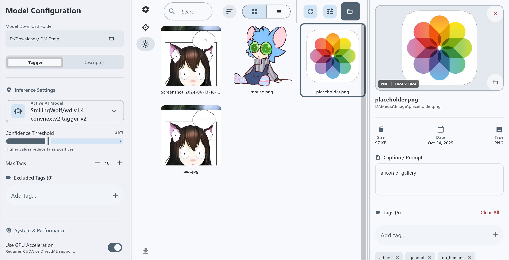
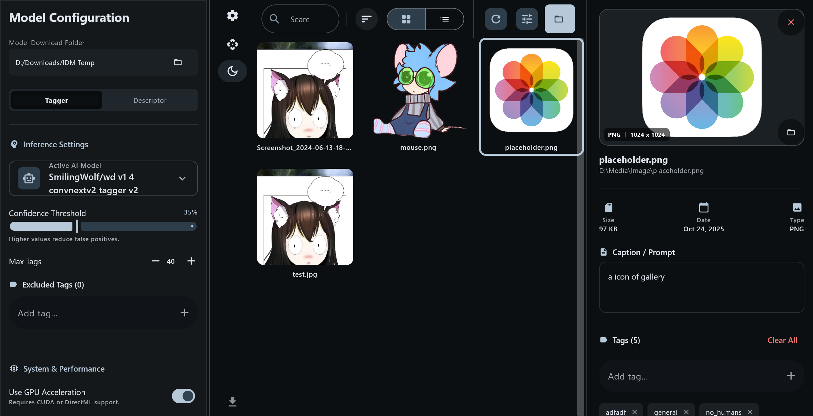
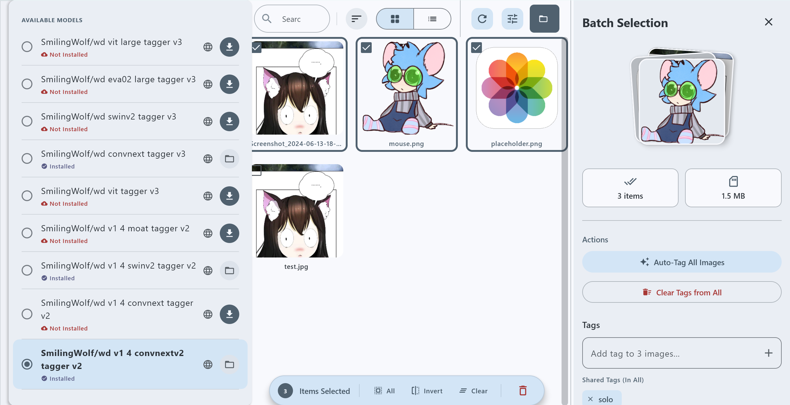

# Ghost AI Image Tagger 🏷️

A powerful desktop application built with Kotlin Multiplatform and Jetpack Compose that uses AI to automatically tag and organize your images. This tool leverages ONNX Runtime and pre-trained models from Hugging Face to analyze images and generate accurate descriptive tags.


-orange)

---
## 🖼️ Screenshots

### Home Screen
**Light Mode**


**Dark Mode**


---
### Batch Image Selection
Select multiple images for bulk tagging and operations.


---

### Model Selection Panel
Choose and manage AI tagging models from Hugging Face.



---

## ✨ Features

### Core Functionality
- **AI-Powered Image Tagging**: Automatically generates descriptive tags for images using ONNX Runtime models
- **Batch Processing**: Process multiple images simultaneously with efficient parallel processing
- **Image Gallery**: Browse and manage your image collection with an intuitive grid/list view
- **Tag Management**: View, edit, add, and remove tags (AI-generated, manual, or file-based)
- **Image Metadata**: Read and write image metadata including EXIF, IPTC, and XMP data

### User Interface
- **Modern Material Design 3**: Clean and intuitive interface with dark theme support
- **Drag & Drop Support**: Easy image import via drag and drop
- **Image Preview**: Detailed image preview with metadata display
- **Sorting & Filtering**: Sort images by various criteria (name, date, size, tags)
- **Search Functionality**: Quickly find images by tags or filename
- **Gallery Modes**: Switch between grid and list views

### Advanced Features
- **Model Downloads**: Download AI models directly from Hugging Face
- **Multiple Model Support**: Choose from different tagger models (WD-EVA02-Large, etc.)
- **Settings Management**: Persistent settings with automatic saving
- **File Explorer Integration**: Open images in system file explorer
- **Batch Tag Export**: Export tags in CSV or other formats
- **Image Selection**: Multi-select images for batch operations

## 🛠️ Tech Stack

### Core Technologies
- **Kotlin 2.3.0**: Modern, concise, and safe programming language
- **Kotlin Multiplatform**: Cross-platform development framework
- **Compose Multiplatform 1.10.0**: Declarative UI framework for desktop
- **Material Design 3**: Modern UI components and design system

### AI & Machine Learning
- **ONNX Runtime 1.23.2**: High-performance ML inference engine
- **Deep Java Library (DJL) 0.36.0**: Deep learning framework for Java
- **Hugging Face Models**: Pre-trained image tagging models

### Networking & Data
- **Ktor 3.4.0**: Asynchronous HTTP client for model downloads
- **Kotlinx Serialization**: JSON serialization/deserialization
- **Apache Commons CSV 1.10.0**: CSV file processing

### Image Processing
- **Metadata Extractor 2.19.0**: Read image metadata (EXIF, IPTC, XMP)
- **Apache Commons Imaging 1.0.0**: Image metadata writing
- **Coil 3.3.0**: Image loading and caching library

### Dependency Injection & Architecture
- **Koin 4.1.1**: Lightweight dependency injection framework
- **Lifecycle ViewModel 2.9.6**: MVVM architecture components
- **Kotlinx Coroutines 1.10.2**: Asynchronous programming

### UI Components
- **FileKit 0.12.0**: File picker and file handling dialogs
- **Reorderable 3.0.0**: Drag-to-reorder lists
- **Material Icons Extended**: Comprehensive icon set

### Development Tools
- **BuildKonfig 0.17.1**: Build-time configuration
- **Kermit 2.0.8**: Multiplatform logging
- **Gradle**: Build automation

## 📋 Prerequisites

Before you begin, ensure you have the following installed:

- **Java Development Kit (JDK) 17 or higher**
  - Download from [Oracle](https://www.oracle.com/java/technologies/downloads/) or [OpenJDK](https://openjdk.org/)
  - Verify installation: `java -version`

- **Git** (for cloning the repository)
  - Download from [git-scm.com](https://git-scm.com/)
  - Verify installation: `git --version`

- **Minimum System Requirements**:
  - RAM: 4GB (8GB recommended for processing large image batches)
  - Disk Space: 2GB (additional space needed for AI models)
  - OS: Windows 10+, macOS 10.14+, or Linux

## 🚀 Installation

### 1. Clone the Repository

```bash
git clone https://github.com/dontknow492/Next.git
cd Next
```

### 2. Verify Gradle Wrapper

The project includes Gradle wrapper scripts, so you don't need to install Gradle separately:

```bash
# On macOS/Linux
./gradlew --version

# On Windows
.\gradlew.bat --version
```

### 3. Download Dependencies

Gradle will automatically download all required dependencies when you first build or run the project.

```bash
# On macOS/Linux
./gradlew build

# On Windows
.\gradlew.bat build
```

## 🎯 Running the Application

### Development Mode

Run the application in development mode with hot reload support:

```bash
# On macOS/Linux
./gradlew :composeApp:run

# On Windows
.\gradlew.bat :composeApp:run
```

The application window will open automatically. If this is your first run, you'll need to:

1. **Download an AI Model**: Go to Settings → Models and download a tagging model from Hugging Face
2. **Select Model Path**: Configure the model path in Settings
3. **Open Image Directory**: Use the "Open Directory" button to browse and tag images

### Building Distributions

Create platform-specific installers:

```bash
# Create DMG for macOS
./gradlew :composeApp:packageDmg

# Create MSI for Windows
.\gradlew.bat :composeApp:packageMsi

# Create DEB for Linux
./gradlew :composeApp:packageDeb
```

Distribution packages will be created in:
```
composeApp/build/compose/binaries/main/
```

## 💡 Usage Examples

### Basic Usage

1. **Launch the Application**
   ```bash
   ./gradlew :composeApp:run
   ```

2. **First-Time Setup**
   - Navigate to Settings (gear icon)
   - Download a model (e.g., "wd-eva02-large-tagger-v3")
   - Wait for download to complete

3. **Tag Images**
   - Click "Open Directory" or drag & drop images into the gallery
   - Select images you want to tag
   - Click the "Tag" button to generate AI tags
   - Review and edit tags as needed

### Advanced Usage

**Batch Tagging Multiple Images:**
```
1. Select multiple images (Ctrl/Cmd + Click)
2. Click "Tag Selected" button
3. AI will process all selected images
4. Tags are automatically saved to image metadata
```

**Custom Tag Management:**
```
1. Click on an image to view details
2. In the tag panel, you can:
   - Add custom tags manually
   - Remove unwanted AI tags
   - Edit tag confidence scores
   - Filter by tag source (AI, Manual, File)
```

**Model Management:**
```
1. Go to Settings → Models
2. View available Hugging Face models
3. Download additional models
4. Switch between models for different tagging styles
```

## 📁 Directory Structure

```
Next/
├── .git/                           # Git version control
├── .gitignore                      # Git ignore patterns
├── README.md                       # This file
├── build.gradle.kts                # Root build configuration
├── settings.gradle.kts             # Project settings and modules
├── gradle.properties               # Gradle configuration
├── gradlew                         # Gradle wrapper (Unix)
├── gradlew.bat                     # Gradle wrapper (Windows)
├── gradle/                         # Gradle wrapper files
│   └── libs.versions.toml          # Dependency version catalog
│
└── composeApp/                     # Main application module
    ├── build.gradle.kts            # App module build configuration
    └── src/
        └── jvmMain/
            └── kotlin/
                └── com/ghost/tagger/
                    ├── main.kt                      # Application entry point
                    ├── MainScreen.kt                # Main UI screen
                    ├── core/  
                    ├── data/    
                    ├── di/                          # Dependency Injection
                    └── ui/                          # UI layer
                        
```

## ⚙️ Configuration

### Application Settings

Settings are automatically saved in the system's standard configuration directory:
- **Windows**: `%APPDATA%/GhostAITagger/`
- **macOS**: `~/Library/Application Support/GhostAITagger/`
- **Linux**: `~/.config/GhostAITagger/`

### Model Configuration

The application uses ONNX models for image tagging. Models are downloaded from Hugging Face:

**Default Model**: `SmilingWolf/wd-eva02-large-tagger-v3`

**Model Files Required**:
- `model.onnx` - The neural network model
- `selected_tags.csv` - Tag vocabulary file

### Build Configuration

Modify `build.gradle.kts` to customize:

```kotlin
buildkonfig {
    packageName = "com.ghost.tagger"
    defaultConfigs {
        buildConfigField(Type.STRING, "APP_NAME", "AI Image Tagger")
        buildConfigField(Type.STRING, "VERSION", "1.0.0")
    }
}

compose.desktop {
    application {
        mainClass = "com.ghost.demo.MainKt"  // Note: Uses demo package for historical reasons
        nativeDistributions {
            targetFormats(TargetFormat.Dmg, TargetFormat.Msi, TargetFormat.Deb)
            packageName = "com.ghost.tagger"
            packageVersion = "1.0.0"
        }
    }
}
```

### Gradle Properties

Adjust memory settings in `gradle.properties`:

```properties
kotlin.daemon.jvmargs=-Xmx3072M
org.gradle.jvmargs=-Xmx3072M -Dfile.encoding=UTF-8
org.gradle.configuration-cache=true
org.gradle.caching=true
```

## 🧪 Testing

Run the test suite:

```bash
# On macOS/Linux
./gradlew test

# On Windows
.\gradlew.bat test
```

## 🐛 Troubleshooting

### Common Issues

**Issue: "Out of Memory" errors during build**
```bash
# Increase Gradle heap size in gradle.properties
org.gradle.jvmargs=-Xmx4096M
```

**Issue: Model download fails**
```
- Check your internet connection
- Verify Hugging Face API access
- Check firewall/proxy settings
```

**Issue: Application won't start**
```bash
# Clean and rebuild
./gradlew clean build
./gradlew :composeApp:run
```

**Issue: Images not loading**
```
- Ensure image directory has read permissions
- Check supported formats: JPG, PNG, WebP, BMP
- Verify image files are not corrupted
```

## 🤝 Contributing

Contributions are welcome! Please feel free to submit a Pull Request.

1. Fork the repository
2. Create your feature branch (`git checkout -b feature/AmazingFeature`)
3. Commit your changes (`git commit -m 'Add some AmazingFeature'`)
4. Push to the branch (`git push origin feature/AmazingFeature`)
5. Open a Pull Request

### Development Guidelines

- Follow Kotlin coding conventions
- Write clean, documented code
- Add tests for new features
- Update documentation as needed
- Use meaningful commit messages

## 📝 License

This project is licensed under the MIT License - see the LICENSE file for details.

## 🙏 Acknowledgments

- **JetBrains** - For Kotlin and Compose Multiplatform
- **Hugging Face** - For hosting pre-trained AI models
- **SmilingWolf** - For the WD-EVA02 tagger models
- **ONNX Runtime** - For efficient ML inference
- **The Kotlin Community** - For amazing libraries and support

## 📧 Contact

For questions or support, please open an issue on GitHub.

---

**Note**: This is a Kotlin Multiplatform project targeting Desktop (JVM). Learn more about [Kotlin Multiplatform](https://www.jetbrains.com/help/kotlin-multiplatform-dev/get-started.html).
